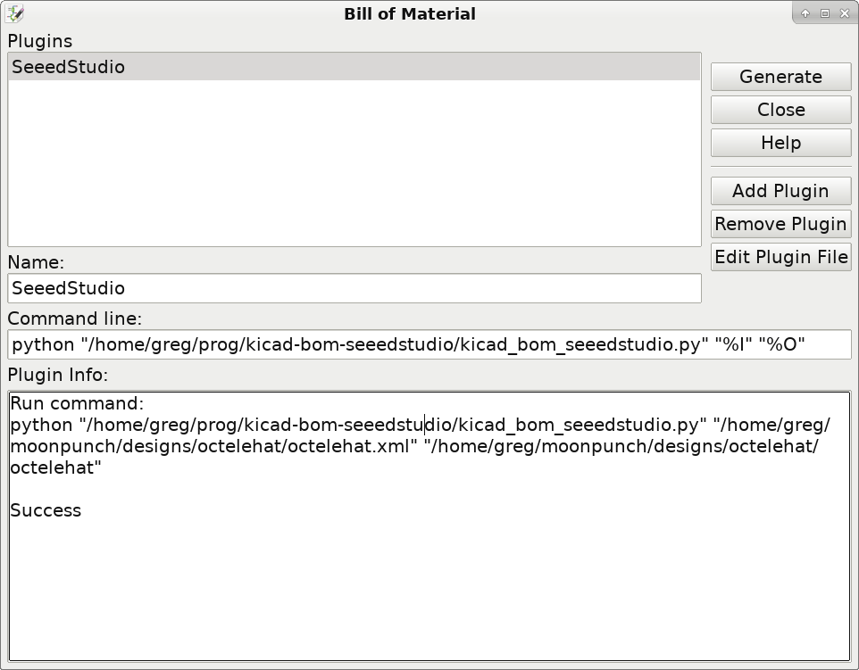

# kicad-bom-seeedstudio

A [KiCad](https://kicad.org) Bill-of-Materials (BOM) plugin to follow
[SeeedStudio](https://www.seedstudio.com)'s [Fusion PCBA](https://www.seeedstudio.com/fusion_pcb.html)
assembly service's [template](https://statics3.seeedstudio.com/assets/file/fusion/bom_template_2016-08-18.csv),
that is:

```
Part/Designator,Manufacture Part Number/Seeed SKU,Quantity
C1,RHA,1
"D1,D2",CC0603KRX7R9BB102,2
```

## How to use it

This plugin is set up to use the KiCad schematic's part data as it is
provided in Seeed Studio's Open Parts Library (OPL) collection for KiCad. That is:

* OPL parts have a `SKU` value defined, that's the default value to export
* If there's no `SKU`, then a `MPN` field is searched and exported
* If neither is found for a part, at the end of the export a warning is issued

Thus for every part either set a `SKU` with the OPL part number or an `MPN`
value.

Add the plugin in eeschema, set it a name, then use it with `Generate`:



## License

Copyright 2017 Gergely Imreh <imrehg@gmail.com>

Licensed under the Apache License, Version 2.0 (the "License");
you may not use this file except in compliance with the License.
You may obtain a copy of the License at

    http://www.apache.org/licenses/LICENSE-2.0

Unless required by applicable law or agreed to in writing, software
distributed under the License is distributed on an "AS IS" BASIS,
WITHOUT WARRANTIES OR CONDITIONS OF ANY KIND, either express or implied.
See the License for the specific language governing permissions and
limitations under the License.
